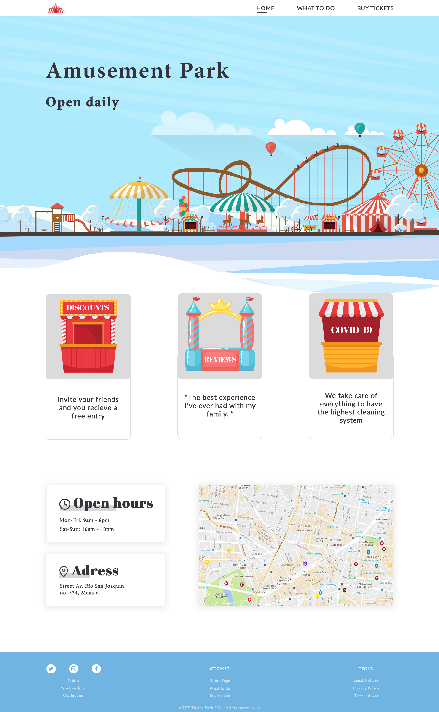
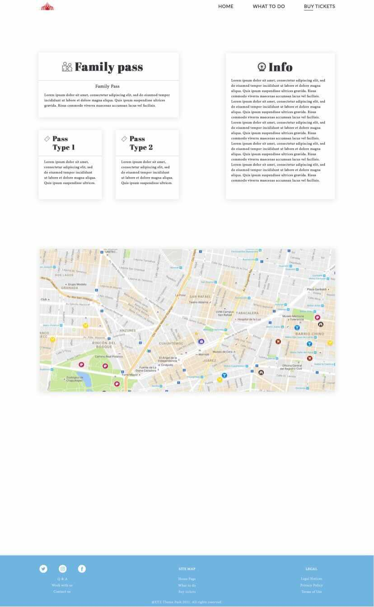
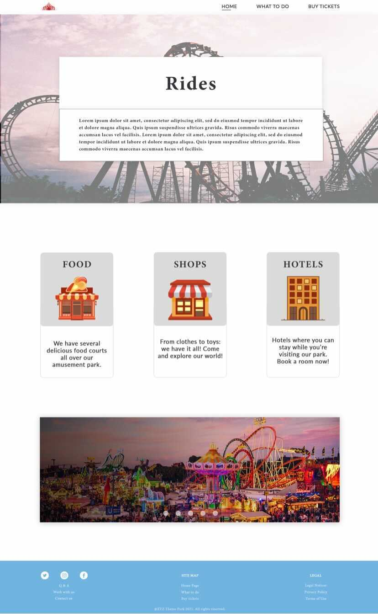

# **Theme Park Website (Group Project)**

Team 106 | Tutor Group 12 | 5 Team Members*
***

## **TABLE OF CONTENTS**

- [PURPOSE OF THE WEBSITE](#purpose-of-the-website)
- [RESEARCHED THEME PARK WEBSITES](#researched-theme-park-websites)
- [CONTENT FOR THE WEBSITE](#content-for-the-website)
- [STRUCTURE OF THE WEBSITE](#structure-of-the-website)
- [WEBSITE DESIGN](#website-design)

### **PURPOSE OF THE WEBSITE**

*WHY THEME PARK OPERATOR  WOULD HAVE A WEBSITE?*

- For online/digital marketing
- To build a brand
- To sell tickets
- To display important information
- To display announcements and updates
- Customer support

*WHO MIGHT LOOK AT SUCH A WEBSITE?*

- Parents
- Children

*WHY PEOPLE WOULD LOOK AT THE WEBSITE?*

- To find information, for example, opening/closing hours, what items are allowed at the park, age
limit, address, phone number etc.
- To purchase tickets
- To look at type of attractions available at the park
- Looking for entertainment

### **RESEARCHED THEME PARK WEBSITES**

1. [Disneyland](https://disneyland.disney.go.com/destinations/disneyland/?CMP=OKC-330339_GM_DLR_destination_disneylandpark_NA)
2. [Drayton Manor](https://www.draytonmanor.co.uk/)
3. [Legoland](https://www.legoland.co.uk)
4. [Twin Lake Spark](https://www.twinlakespark.co.uk)
5. [SeaWorld Orlando](https://seaworld.com/orlando/)

### **CONTENT FOR THE WEBSITE**

- Information about how to buy tickets
- Hotel
- List of attractions, Restaurants, café, Shops
- Map of the park
- Opening dates and hours
- Photo Gallery of attractions and visitors self pics
- Frequently asked questions
- Contact page
- Social links
- We are hiring
- Safety/rules information

### **STRUCTURE OF THE WEBSITE**

#### Page 1. Home page:
- Navigation/menu/logo
- Slideshow
- Features section
- Address, hours and map section
- Footer

#### Page 2. What to do:
- Navigation/menu/logo
- Navigation/menu
- Section for rides
- Section for hotel, food and shops
- Slideshow
- Footer

#### Page 3. Buy tickets:
- Navigation/menu/logo
- Navigation/menu
- Section for various tickets/passes
- Section for information
- Map
- Footer

### **WEBSITE DESIGN**

The wireframes for the project are located in the following directory.

        theme_park_group_project/design/wireframes

#### Final Website Design

***

`*` Team members' names are available upon request. Names were not included for privacy reasons.
